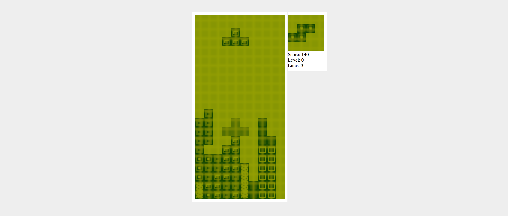

# AI-T3TR0S

This is a heavily modified version of single player
[T3TR0S](http://github.com/imalooney/t3tr0s) with an AI implementation. 

The AI utilized the Breadth First Search and Depth First Search algorithms paired with a rating scheme to calculate optimal Tetris play.

## Setup

1. Install [Leiningen](http://leiningen.org)
1. Run `lein cljsbuild auto` to run the auto-compiler.
1. Play the game by opening `public/index.html`

